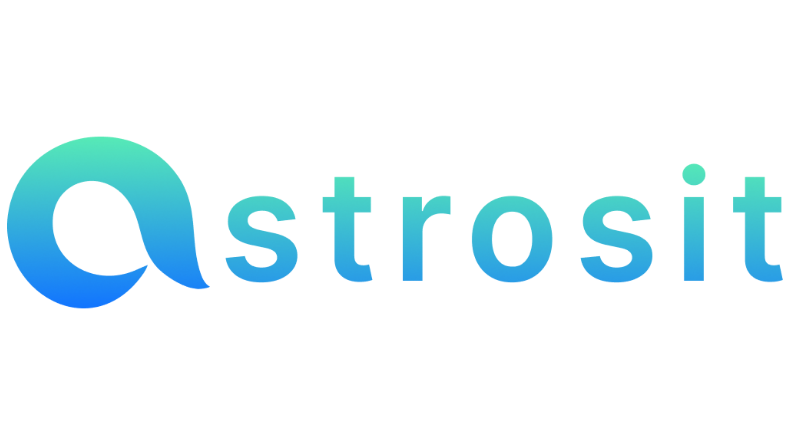
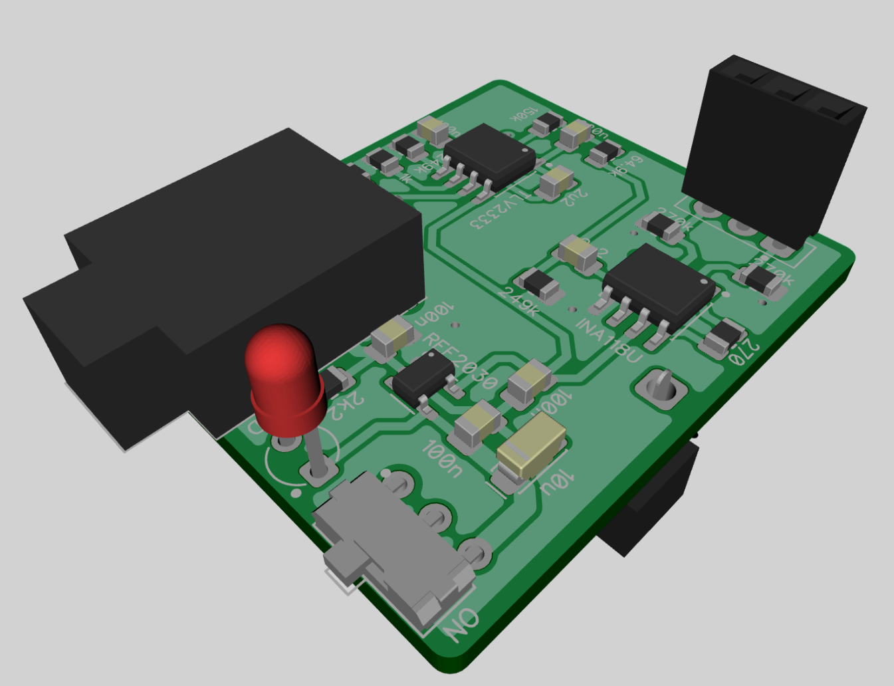
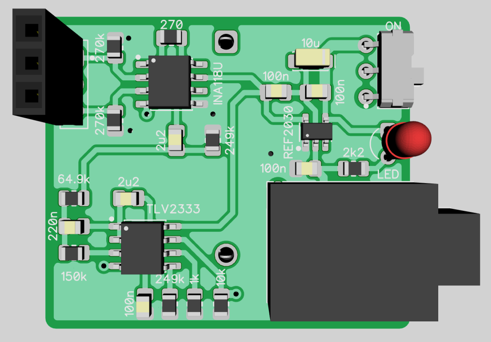
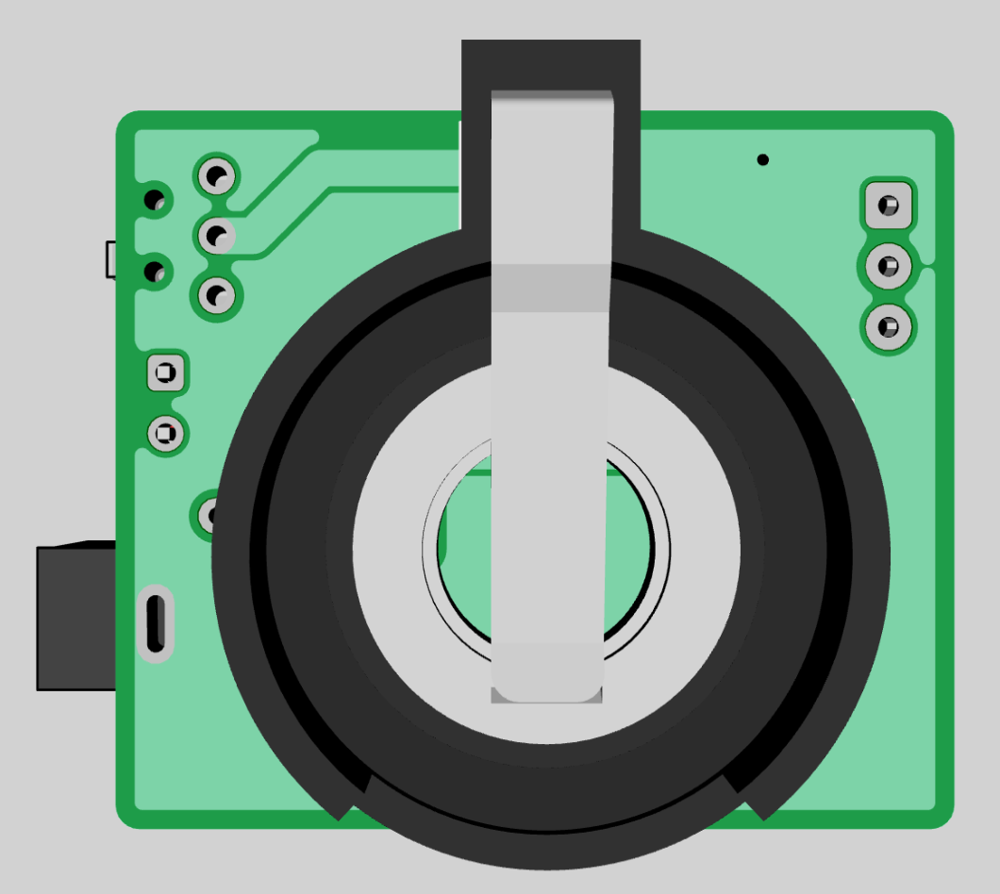
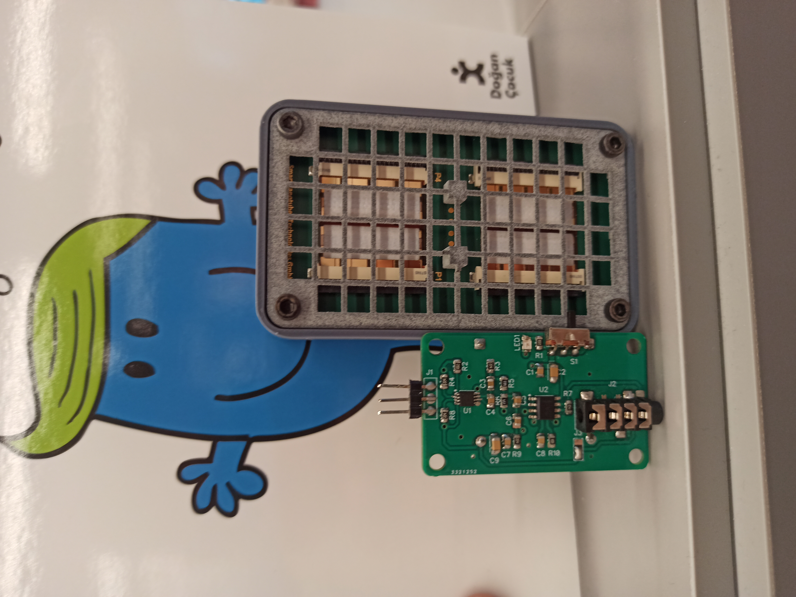
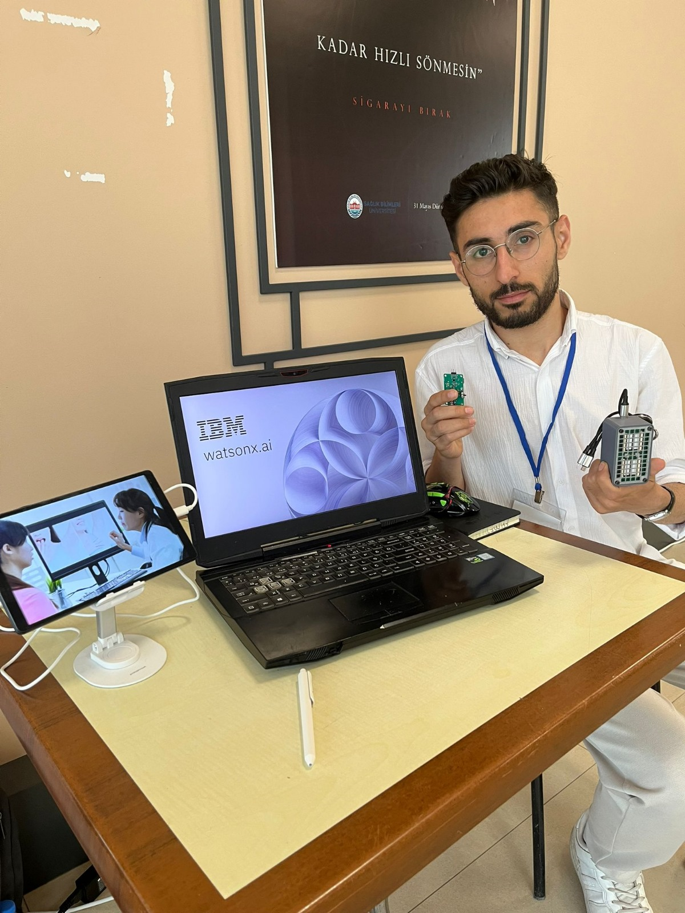

# 🧠 SmellControl: Bringing the Power of Smell to Machines with IBM Watsonx

 <!-- Görsel: Logo -->

## 1. 🌍 Introduction: The Missing Sense in Machine Intelligence

In today’s AI-driven world, machines can **see, hear, touch**, and **learn**—but they **still cannot smell**. This missing sense limits breakthroughs in fields like:

- 🌿 Environmental Monitoring  
- 🏭 Industrial Safety  
- 🧬 Public Health  
- 🌾 Agriculture  
- 🚀 Space Exploration  

**SmellControl**, developed by **Astrosit** for the **IBM Watsonx Hackathon 2025**, is an **AI-powered**, **real-time toxic gas and odor detection system** using **nanohybrid sensors**, **advanced signal processing**, and **IBM Watsonx Cloud AI tools**.

---

## 2. 🧪 The Technological Problem: Why Machines Must Smell

According to WHO:

- ⚠️ 7+ million premature deaths annually from air pollution  
- 💸 $80B+ in yearly economic losses due to industrial gas leaks  
- 🌫️ 15% of global carbon emissions stem from gas emissions  

SmellControl offers **proactive odor detection**, transforming how we **protect health, safety, and the environment**.

---

## 3. 🔬 Hardware Innovation: Smell iX16 + 64-Channel Sensor Architecture

 
 
  <!-- Görsel: Devre/sensör şeması -->

At the core of SmellControl is our **nanohybrid sensor array** powered by:

- **4 × Smell iX16 chips**  
- **64 total sensor channels**  
- **Sub-ppb sensitivity**  
- **Sampling every 1.8 seconds**  
- **3.7g device weight, 1µW power consumption**

Each odor leaves a **unique resistive fingerprint** transformed into a **digital smell signature**.

---

## 4. 🧠 Signal Processing & Machine Learning Workflow

### 🔁 4.1 Signal Processing Pipeline

1. **Raw Signal Acquisition**  
2. **Noise Filtering**: Kalman, Butterworth, Moving Average  
3. **Normalization**: `StandardScaler`  
4. **Feature Extraction**: mean, variance, entropy, skewness, kurtosis  
5. **Dimensionality Reduction**: PCA + t-SNE

### 🤖 4.2 Model Training

We trained multiple models on labeled gas/VOC classes:

- **K-NN**: 98% accuracy (F1-score: 0.97, Precision: 0.96, Recall: 0.98)  
- Decision Tree, Random Forest, SVM, Logistic Regression, AdaBoost, Gradient Boost

All models evaluated with **cross-validation** & **ROC-AUC**.

---

## 5. ☁️ IBM Watsonx & Cloud Integration

### ⚙️ 5.1 Data Architecture

- 📡 Sensor → MQTT → IBM Cloud  
- 🧾 IBM Object Storage + DB2 Warehouse  
- ⚡ IBM Cloud Functions trigger model updates  
- 📊 Watsonx.ai Studio handles classification and analytics

### 🔍 5.2 Watsonx Applications

- 🔴 Real-time odor classification  
- 📚 RAG for referencing historical events  
- ♻️ Model retraining pipeline  
- 🧠 AutoAI integration

---

## 6. 🌐 Use Cases Across Industries

SmellControl can be deployed in **drones, wearables, handhelds, smart nodes**.

| Industry            | Application Examples                                    |
|---------------------|---------------------------------------------------------|
| 🌋 Disaster Relief   | Gas leaks after earthquakes, industrial spills         |
| 🚜 Agriculture       | Fertilizer monitoring, soil health                     |
| 🏥 Public Health     | Indoor air pollution detection                         |
| 🌎 Environmental     | VOC, methane, ozone, NO₂ tracking                      |
| 🛡️ Defense & Security| Chemical warfare agent detection                        |
| 🏠 Smart Homes/IoT   | HVAC optimization, wearable gas monitors               |

---

## 7. 🌱 Environmental Impact & Climate Action

SmellControl supports sustainability:

- 🧪 Tracks greenhouse gases (CH₄, CO₂, NOₓ)  
- 🕵️ Early detection prevents emissions  
- 📈 ESG & carbon reporting  
- 🌍 Geolocated alerts

---

## 8. 🎯 UN Sustainable Development Goals (SDGs)

SmellControl aligns with:

- **SDG 3** – Good Health and Well-being  
- **SDG 9** – Industry, Innovation and Infrastructure  
- **SDG 11** – Sustainable Cities and Communities  
- **SDG 12** – Responsible Consumption and Production  
- **SDG 13** – Climate Action  
- **SDG 15** – Life on Land  

---

## 9. 📊 Market Size & Business Strategy

### 🌐 Market Potential

| Metric | Value |
|--------|-------|
| TAM    | $600B (Global) |
| SAM    | $120B (Europe) |
| SOM    | $9B (Turkey)   |
| 5-Year Revenue | $510M–$850M (3–5% share) |

### 🧩 Business Models

- **B2B**: Factory integration  
- **B2G**: Smart cities, air monitoring  
- **B2C**: Personal gas monitors  
- **Consulting**: AI smell analytics

---

## 10. 🗓️ Project Timeline

| Phase                 | Timeline          |
|-----------------------|------------------|
| Prototype             | Q1–Q2 2025       |
| IBM Hackathon Launch | Q2 2025          |
| MVP Pilots           | Q3–Q4 2025       |
| Large Deployment     | Q1 2026          |
| Global Expansion     | Q3–Q4 2026       |

---

## 11. 🚀 Future Vision: From Hackathon to Global Impact

Winning the **IBM Watsonx Hackathon** would mark the start of:

- 🌐 SmellControl U.S. launch @ IBM TechXchange 2025  
- 🧠 Global odor dataset development  
- 📦 SDK for third-party developers  
- 🏙️ Smart city collaborations  
- 🧭 Integrating smell into IoT (alongside camera, mic, GPS, and touch)

SmellControl aims not just to **add a sensor**, but to **redefine machine perception**.

---

## 12. 🌟 Conclusion: A New Sensory Era for Machines

**SmellControl** is not merely a sensor product—it is a **transformative innovation** that redefines how machines interact with the world 🌍. By granting artificial intelligence the long-missing **sense of smell** 👃🤖, our system fills a critical technological gap that has long restricted machine perception and environmental intelligence.

In a world increasingly threatened by:

- ⚠ Industrial hazards  
- 🌪 Climate-driven disasters  
- 🏭 Invisible air pollutants  

SmellControl offers a **portable, scalable, and data-rich solution** that responds **in real time**, with **precision** and **intelligence** ⏱🧠.

### 🆚 SmellControl vs. Conventional Gas Detection

| Feature                | Conventional Systems   | SmellControl                      |
|------------------------|------------------------|-----------------------------------|
| Gas Coverage           | Single or Few Gases    | Dozens (Multi-gas) 🧪              |
| Size & Portability     | Bulky                  | 3.7g Ultra-light 🪶                |
| Power Consumption      | High                   | 1µW Ultra-low 🔋                   |
| Data Capacity          | Limited                | 6,000+ datapoints/event 📊         |
| Intelligence           | Rule-based             | ML-driven, adaptive 🤖             |
| Cloud Connectivity     | Often offline          | IBM Watsonx & Cloud Integrated ☁  |

### 💡 What Sets SmellControl Apart

- ✅ 64-channel nanohybrid array at **ppb sensitivity**
- ✅ **Machine learning** transforms signals into insights
- ✅ Powered by **IBM Watsonx + Cloud** for:
  - Real-time odor classification  
  - Continuous model evolution via RAG 🔄🧠  
  - Cross-device learning at global scale 🌍

### 🌿 Climate Action Meets Technology

In the **climate crisis** era, early detection of toxic gases is no longer a luxury—it is a **necessity** 🚨. From methane leaks 🌾 to VOCs in cities 🌆, **SmellControl gives the world a fighting chance** to act **before it's too late** 🛡.

By providing:

- 🔔 Early warnings  
- 📈 Detailed analytics  
- ☁ Real-time cloud feedback  

SmellControl ensures **security**, **sustainability**, and **smart governance**—all from a single platform 🔐🌱.

### 🔬 A Fusion of Technologies

SmellControl is a convergence of:

- 🧬 **Nanotechnology**  
- 🤖 **Artificial Intelligence**  
- ☁ **Cloud Computing**  

It is designed to be:

- ⚡ Fast  
- 🔄 Flexible  
- 🎒 Field-deployable  

Ready to revolutionize:

- 🏭 Industrial safety  
- 🏥 Public health  
- 🏙 Smart cities  

---

### 🏆 The Road Ahead

Winning the **IBM Watsonx Hackathon 2025** 🏆 will allow us to:

- Launch SmellControl globally 🌐  
- Debut at **IBM TechXchange USA 🇺🇸**  
- Expand our odor database across sectors  
- Release an SDK for third-party developers  
- Deploy city-wide **smart odor grids**

---

> **SmellControl doesn’t just detect smells—**  
> it **transforms** them into **actionable insights** 🔍📊,  
> empowering a **cleaner**, **safer**, and more **sustainable world** 🌍.

 <!-- Görsel: Kapanış görseli önerisi -->

---

## 🙌 Let's Help Machines Smell—and Help Humanity Breathe Easier

> **SmellControl** is how we teach machines to smell.  
> In doing so, we help humanity live safer, cleaner, and smarter lives.

